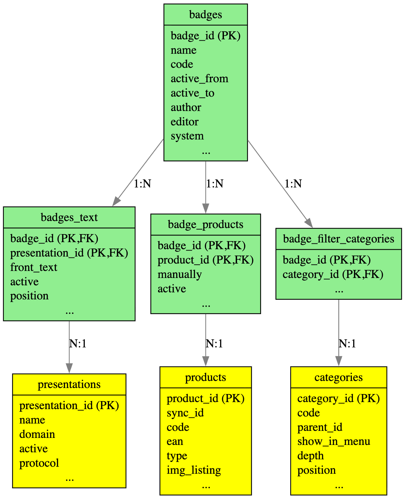

# Badges Module Database Schema

## Database Diagram

## Overview

The Badges module in MasterShop provides a comprehensive system for managing product badges (labels/tags) that can be displayed on products to highlight special features, promotions, or status information. The module supports both manual badge assignment and automatic badge generation based on predefined rules.

## Tables Description

### Module Tables (Green)

The Badges module consists of 4 core tables that handle badge management:

#### 1. `badges` (Main Table)
- **Primary Key**: `badge_id`
- **Purpose**: Stores badge definitions, appearance settings, and activation rules
- **Key Fields**:
  - `badge_id` - Auto-increment primary key
  - `name` - Internal badge name for administration
  - `code` - Internal code for system integrations
  - `active_from/active_to` - Date range for badge activation
  - `author/editor` - User tracking fields (⚠️ Missing foreign key constraints)
  - `system` - Flag to prevent deletion of system badges

#### 2. `badges_text` (Multi-language Support)
- **Primary Key**: Composite (`badge_id`, `presentation_id`)
- **Purpose**: Stores localized badge text for different presentations/languages
- **Key Fields**:
  - `badge_id` - Foreign key to badges table
  - `presentation_id` - Foreign key to presentations table
  - `front_text` - Localized badge text displayed to users
  - `active` - Activation status for specific presentation
  - `position` - Display order

#### 3. `badge_products` (Badge-Product Relationships)
- **Primary Key**: Composite (`badge_id`, `product_id`)
- **Purpose**: Manages many-to-many relationship between badges and products
- **Key Fields**:
  - `badge_id` - Foreign key to badges table
  - `product_id` - Foreign key to products table
  - `manually` - Flag indicating manual assignment vs automatic
  - `active` - Status flag used during badge recalculation

#### 4. `badge_filter_categories` (Category Filtering)
- **Primary Key**: Composite (`badge_id`, `category_id`)
- **Purpose**: Controls which categories show specific badges in filters
- **Key Fields**:
  - `badge_id` - Foreign key to badges table
  - `category_id` - Foreign key to categories table

### Referenced Tables (Yellow)

The module integrates with 3 external system tables:

#### 1. `presentations`
- **Primary Key**: `presentation_id`
- **Purpose**: Multi-language/multi-site support
- **Relationship**: Referenced by `badges_text` for localization

#### 2. `products`
- **Primary Key**: `product_id`
- **Purpose**: Product catalog management
- **Relationship**: Referenced by `badge_products` for badge assignments

#### 3. `categories`
- **Primary Key**: `category_id`
- **Purpose**: Product categorization system
- **Relationship**: Referenced by `badge_filter_categories` for filtering

## Relationships

### One-to-Many Relationships
- **badges → badges_text**: One badge can have multiple language versions
- **badges → badge_products**: One badge can be assigned to multiple products
- **badges → badge_filter_categories**: One badge can filter in multiple categories

### Many-to-One Relationships
- **badges_text → presentations**: Multiple badge texts can reference one presentation
- **badge_products → products**: Multiple badge assignments can reference one product
- **badge_filter_categories → categories**: Multiple badge filters can reference one category

### Foreign Key Constraints
- ✅ `badges_text_ibfk_1`: `badge_id` → `badges.badge_id`
- ✅ `badges_text_ibfk_2`: `presentation_id` → `presentations.presentation_id`
- ✅ `badge_products_ibfk_1`: `badge_id` → `badges.badge_id`
- ✅ `badge_products_ibfk_2`: `product_id` → `products.product_id`
- ✅ `badge_filter_categories_ibfk_1`: `badge_id` → `badges.badge_id`
- ✅ `badge_filter_categories_ibfk_2`: `category_id` → `categories.category_id`

## Key Features

- **Multi-language Support**: Through `badges_text` and `presentations` integration
- **Flexible Assignment**: Both manual and automatic badge assignment to products
- **Category Filtering**: Badges can be displayed in specific category filters
- **Time-based Activation**: Badges can be active only during specific date/time ranges
- **Template System**: Support for predefined badge templates
- **System Protection**: System badges cannot be deleted
- **Audit Trail**: Author and editor tracking for change management

## Notes

### Missing Foreign Key Constraints
The main `badges` table has missing foreign key constraints for:
- ⚠️ `author` field → should reference `users.user_id`
- ⚠️ `editor` field → should reference `users.user_id`

These fields track who created and last modified each badge but lack proper referential integrity, representing a potential data integrity issue that should be addressed in future updates.

### Installation Script Discrepancy
The `badge_filter_categories` table is missing from the module's installation script (`_install/sql.sql`) but exists in the main database schema, suggesting the table was added later without updating the module's installation files.
