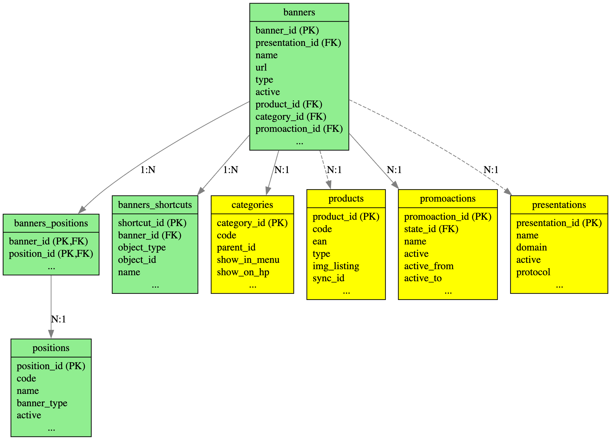

# Banners Module Database Schema

## Database Diagram

## Overview

The Banners module is a comprehensive banner management system for the MasterShop e-commerce platform. This diagram shows the core database structure and relationships within the module.

## Tables Description

### Module Tables (Green)

#### `banners`
**Main table** storing all banner data including content, images, scheduling, and associations.

**Key Fields:**
- `banner_id` - Primary key (auto-increment)
- `presentation_id` - Links to language/presentation system
- `name` - Banner name/title
- `url` - Target URL when banner is clicked
- `type` - Banner type (hp-slider, menu, teaser, etc.)
- `active` - Active status (1/0)
- `product_id` - Associated product ID
- `category_id` - Associated category ID (FK with constraint)
- `promoaction_id` - Associated promotional action ID (FK with constraint)

#### `banners_positions`
**Junction table** implementing many-to-many relationship between banners and their display positions.

**Key Fields:**
- `banner_id` - Foreign key to banners table (part of composite PK)
- `position_id` - Foreign key to positions table (part of composite PK)

#### `banners_shortcuts`
**Shortcuts table** managing banner shortcuts for recommended categories and other objects.

**Key Fields:**
- `shortcut_id` - Primary key (auto-increment)
- `banner_id` - Foreign key to banners table
- `object_type` - Type of linked object (category, article, page, text)
- `object_id` - ID of linked object
- `name` - Shortcut name

#### `positions`
**Positions table** defining banner display locations and layout positions on the website.

**Key Fields:**
- `position_id` - Primary key (auto-increment)
- `code` - Unique position code identifier
- `name` - Human-readable position name
- `banner_type` - Type of banners allowed in this position
- `active` - Active status (1/0)

### Referenced Tables (Yellow)

#### `categories`
Product categories that banners can be associated with.
- **Relationship**: `banners.category_id` → `categories.category_id`
- **Constraint**: Foreign key with ON DELETE SET NULL

#### `promoactions`
Promotional actions/campaigns that banners can promote.
- **Relationship**: `banners.promoaction_id` → `promoactions.promoaction_id`
- **Constraint**: Foreign key with ON DELETE SET NULL

#### `products`
Products that banners can feature or promote.
- **Relationship**: `banners.product_id` → `products.product_id`
- **Constraint**: ⚠️ **No formal FK constraint** - application-level relationship only

#### `presentations`
Language/presentation settings for multi-language support.
- **Relationship**: `banners.presentation_id` → `presentations.presentation_id`
- **Constraint**: ⚠️ **No formal FK constraint** - application-level relationship only

## Relationships

### Formal Foreign Key Constraints (Solid Lines)
- **banners → categories**: Each banner can belong to one category
- **banners → promoactions**: Each banner can be associated with one promotional action
- **banners_positions → banners**: Junction table maintains banner relationships
- **banners_shortcuts → banners**: Shortcuts are linked to specific banners
- **banners_positions → positions**: Junction table maintains position relationships

### Application-Level Relationships (Dashed Lines)
- **banners → products**: Banners can feature products (no DB constraint)
- **banners → presentations**: Banners support multi-language (no DB constraint)

## Key Features

- **Multi-position Support**: Banners can be displayed in multiple positions via junction table
- **Category & Product Integration**: Direct links to e-commerce entities
- **Promotional Campaigns**: Integration with promoaction system
- **Shortcuts System**: Flexible object linking for recommendations
- **Multi-language Support**: Presentation-based localization
- **Data Integrity**: Formal FK constraints where appropriate, with cascade delete protection

## Notes

⚠️ **Missing Foreign Key Constraints**: The relationships to `products` and `presentations` tables exist at the application level but lack formal database constraints, which could lead to referential integrity issues.
